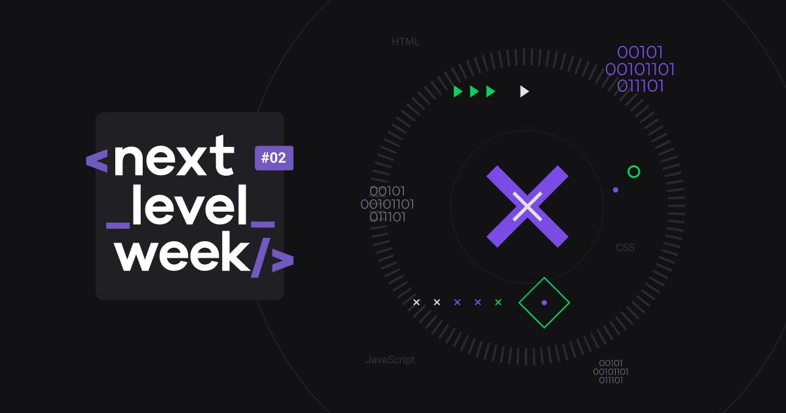

## :clipboard: Index

- [About](#-About)
- [Utilized tecnology](#-Utilized-tecnology)
- [How to executed](#-How-to-executed)
- [Preview](#-Preview)

---

## :computer: Preview

    

---

## :book: About